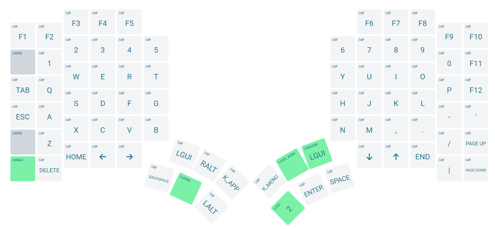
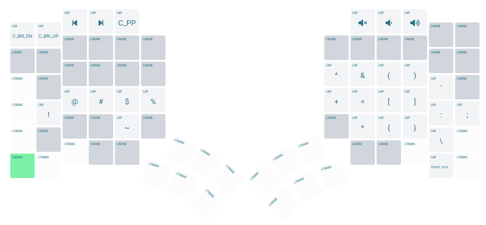
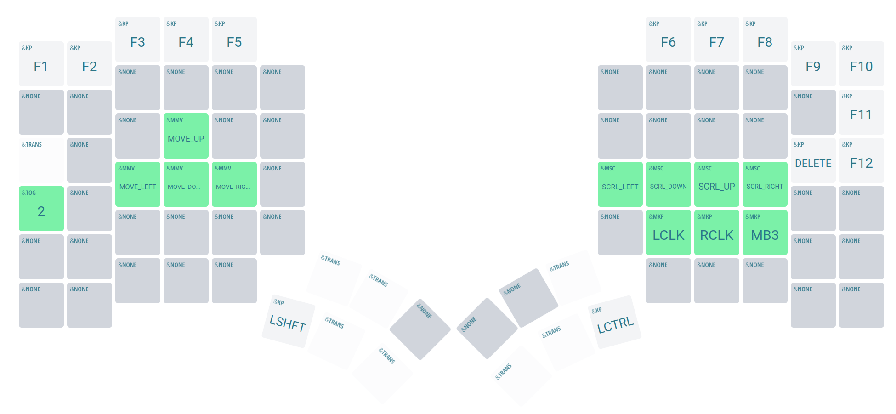

# Glove80 Keyboard Layout

This config is constantly changing, so the linked config here might be outdated.
My current keyboard layout including combo keys and mouse simulation for the glove80 is available [here](https://my.glove80.com/#/layout/user/0e9d8b1b-195f-47a6-9b49-1cb074c009d8)

## Layer 0

## Layer 1 - Symbols

## Layer 2 - Mouse

